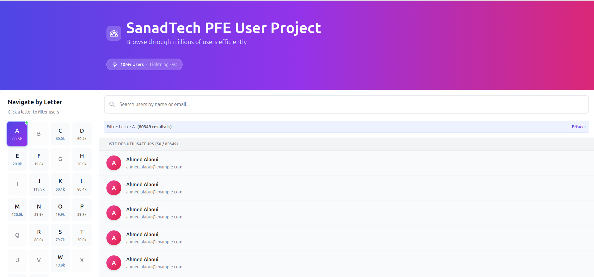
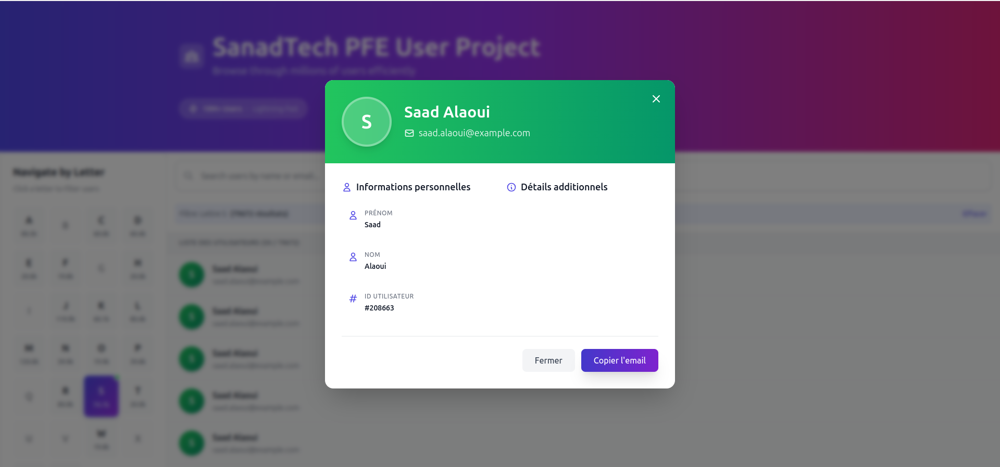
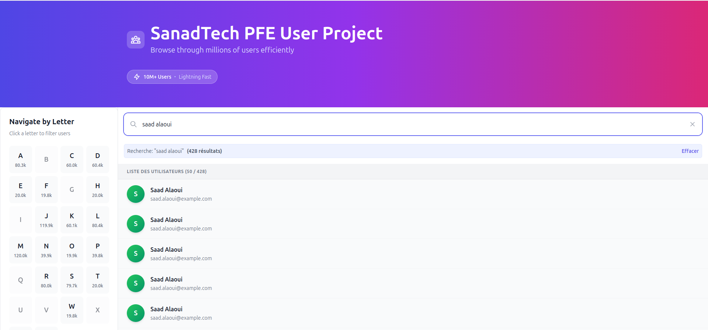
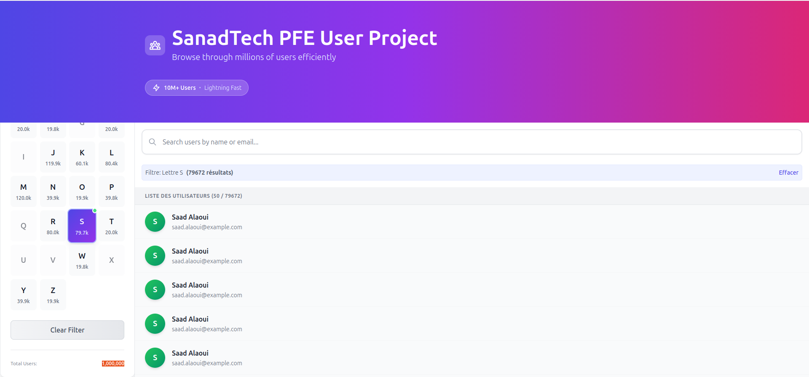

# User List Application - Infinite Scrolling with Efficient Search

A high-performance web application designed to handle large-scale user data (scalable to 10M+ users) with infinite scrolling, alphabet navigation, and real-time search powered by PostgreSQL trigram indexes.

## 📋 Table of Contents

- [Overview](#overview)
- [Features](#features)
- [Technology Stack](#technology-stack)
- [Project Structure](#project-structure)
- [Installation](#installation)
- [Docker Deployment](#docker-deployment)
- [Performance Optimizations](#performance-optimizations)
- [Screenshots](#screenshots)
- [Database Schema](#database-schema)

## 🎯 Overview

Cette application démontre une gestion efficace de larges ensembles de données (10M+ utilisateurs) avec :
- **Infinite scrolling** avec IntersectionObserver natif
- **Navigation alphabétique** avec statistiques en temps réel
- **Recherche instantanée** dès le 1er caractère grâce aux index GIN/Trigramme PostgreSQL
- **Architecture Docker** complète avec PostgreSQL, pgAdmin, Backend Node.js et Frontend React
- **Performance optimisée** : recherche sub-50ms sur 10 millions d'utilisateurs

## ✨ Features

### Interface Utilisateur
- ✅ **Liste d'utilisateurs** avec scroll infini natif (IntersectionObserver)
- ✅ **Navigation alphabétique** (A-Z) avec compteurs dynamiques
- ✅ **Recherche en temps réel** dès 1 caractère (debounce 300ms)
- ✅ **Modal de détails** avec animations fluides
- ✅ **Design moderne** avec Tailwind CSS et dégradés
- ✅ **Interface responsive** optimisée mobile/desktop

### Performance Backend
- ⚡ **Index PostgreSQL GIN** avec extension `pg_trgm` pour recherche trigramme
- ⚡ **Requêtes ILIKE optimisées** : ~35ms sur 10M utilisateurs
- ⚡ **Pagination cursor-based** pour navigation fluide
- ⚡ **Compression gzip** des réponses HTTP
- ⚡ **Rate limiting** configurable (optionnel)

## 🛠 Technology Stack

### Frontend
- **React 19** - UI framework
- **TypeScript 5.9** - Type safety
- **Axios** - HTTP client
- **Tailwind CSS 3.4** - Styling
- **Vite 7** - Build tool ultra-rapide

### Backend
- **Node.js 18** - Runtime
- **Express 5** - Web framework
- **TypeScript 5.9** - Type safety
- **PostgreSQL 16** - Base de données
- **pg-copy-streams** - Import massif de données

### Infrastructure
- **Docker & Docker Compose** - Containerisation
- **Nginx** (dans Docker) - Serveur web pour le frontend
- **pgAdmin 4** - Interface de gestion PostgreSQL

## 📁 Project Structure

```
.
├── backend/
│   ├── src/
│   │   ├── config/
│   │   │   └── db.ts              # Configuration PostgreSQL
│   │   ├── controllers/
│   │   │   └── userController.ts  # Logique des routes
│   │   ├── middleware/
│   │   │   └── errorHandler.ts    # Gestion des erreurs
│   │   ├── routes/
│   │   │   └── userRoutes.ts      # Définition des routes
│   │   ├── services/
│   │   │   └── userService.ts     # Logique métier + requêtes SQL
│   │   ├── types/
│   │   │   └── index.ts           # Types TypeScript
│   │   ├── utils/
│   │   │   └── seeder.ts          # Génération de 1M users
│   │   └── server.ts              # Point d'entrée Express
│   ├── Dockerfile                 # Image Docker backend
│   ├── package.json
│   └── tsconfig.json
│
├── frontend/
│   ├── src/
│   │   ├── components/
│   │   │   ├── Layout/
│   │   │   │   ├── Header.tsx     # En-tête avec gradient
│   │   │   │   └── Sidebar.tsx    # Navigation alphabétique
│   │   │   ├── Navigation/
│   │   │   │   ├── AlphabetMenu.tsx  # Menu A-Z
│   │   │   │   └── SearchBar.tsx     # Barre de recherche
│   │   │   └── UserList/
│   │   │       ├── UserList.tsx      # Liste avec IntersectionObserver
│   │   │       ├── UserItem.tsx      # Carte utilisateur
│   │   │       └── UserModal.tsx     # Modal de détails
│   │   ├── hooks/
│   │   │   ├── useUserData.ts        # Hook principal (fetch + scroll)
│   │   │   ├── useAlphabetNavigation.ts  # Stats alphabet
│   │   │   └── useSearch.ts          # Recherche avec debounce
│   │   ├── services/
│   │   │   └── api.ts                # Client Axios
│   │   ├── types/
│   │   │   └── index.ts              # Types partagés
│   │   ├── utils/
│   │   │   └── helpers.ts            # Fonctions utilitaires
│   │   ├── App.tsx                   # Composant racine
│   │   ├── main.tsx                  # Point d'entrée React
│   │   └── index.css                 # Styles globaux
│   ├── Dockerfile                    # Image Docker frontend
│   ├── nginx.conf                    # Config Nginx
│   ├── package.json
│   ├── tailwind.config.js
│   ├── tsconfig.json
│   └── vite.config.ts
│
├── docker-compose.yml      # Orchestration des services
├── init.sql                # Script d'initialisation PostgreSQL
└── README.md               # Ce fichier
```

## 📦 Installation

### Prérequis
- **Docker** 20+ et **Docker Compose** 2+
- (Optionnel) Node.js 18+ et npm pour développement local

### 🚀 Démarrage Rapide avec Docker

```bash
# 1. Cloner le repository
git clone https://github.com/votre-username/user-list-app.git
cd user-list-app

# 2. Lancer tous les services avec Docker Compose
docker-compose up --build

# 3. Attendre ~30 secondes que tout démarre
# Les services seront accessibles à :
# - Frontend:     http://localhost:80
# - Backend API:  http://localhost:3000
# - pgAdmin:      http://localhost:5050
```

### 🗄️ Seed de la base de données

Le seeder génère **1 million d'utilisateurs** automatiquement au premier lancement du backend :

```typescript
// backend/src/utils/seeder.ts
// Génère 1M users avec pg-copy-streams (très rapide)
// Format: "User [random_suffix]"
```

**Pour générer 10 millions d'utilisateurs** :
1. Modifiez `backend/src/utils/seeder.ts` ligne 39 : `for (let i = 0; i < 10000000; i++)`
2. Relancez `docker-compose up --build`

### 🔧 Développement Local (sans Docker)

#### Backend
```bash
cd backend
npm install

# Configurer .env
cat > .env << EOF
DB_HOST=localhost
DB_USER=postgres
DB_PASSWORD=admin
DB_NAME=sanad_pfe
DB_PORT=5432
PORT=3000
EOF

# Lancer PostgreSQL (via Docker ou local)
# Puis démarrer le serveur
npm run dev
```

#### Frontend
```bash
cd frontend
npm install

# Configurer .env
echo "VITE_API_URL=http://localhost:3000/api" > .env

# Démarrer le dev server
npm run dev
```

## 🐳 Docker Deployment

### Architecture Docker

```yaml
# docker-compose.yml
services:
  db:           # PostgreSQL 16 avec extension pg_trgm
  pgadmin:      # Interface web de gestion DB
  api:          # Backend Node.js Express
  web:          # Frontend React servi par Nginx
```

### Variables d'environnement

#### Backend (`backend/.env`)
```env
# Database
DB_HOST=db              # Nom du service Docker
DB_USER=postgres
DB_PASSWORD=admin
DB_NAME=sanad_pfe
DB_PORT=5432

# Server
PORT=3000
NODE_ENV=production
```

#### Frontend (`frontend/.env`)
```env
VITE_API_URL=http://localhost:3000/api
```

### Commandes Docker utiles

```bash
# Démarrer tous les services
docker-compose up -d

# Voir les logs
docker-compose logs -f api        # Backend
docker-compose logs -f web        # Frontend
docker-compose logs -f db         # PostgreSQL

# Rebuild après modifications
docker-compose up --build

# Arrêter tout
docker-compose down

# Supprimer les volumes (⚠️ supprime la DB)
docker-compose down -v

# Accéder au shell d'un container
docker exec -it sanad_backend sh
docker exec -it sanad_postgres psql -U postgres -d sanad_pfe
```

### pgAdmin - Interface de gestion

1. Accéder à http://localhost:5050
2. Se connecter avec :
   - **Email** : `admin@admin.com`
   - **Password** : `admin`
3. Ajouter un serveur PostgreSQL :
   - **Host** : `db` (nom du service Docker)
   - **Port** : `5432`
   - **Username** : `postgres`
   - **Password** : `admin`

## ⚡ Performance Optimizations

### Base de données PostgreSQL

#### 1. Extension Trigramme (pg_trgm)
```sql
-- init.sql
CREATE EXTENSION IF NOT EXISTS pg_trgm;

-- Index GIN pour recherche trigramme
CREATE INDEX idx_users_name_trgm ON users 
  USING gin (name gin_trgm_ops);
```

**Résultat** : Recherche ILIKE en **~35ms** sur 10M utilisateurs

#### 2. Index B-Tree pour tri
```sql
CREATE INDEX idx_users_name_btree ON users (name);
```

**Résultat** : Tri alphabétique ultra-rapide

#### 3. Requêtes optimisées
```typescript
// userService.ts - Recherche optimisée
const sql = `
  SELECT * FROM users 
  WHERE name ILIKE $1 
  ORDER BY name ASC 
  LIMIT $2 OFFSET $3
`;
```

## 🗄️ Database Schema

### Table `users`

```sql
CREATE TABLE users (
    id SERIAL PRIMARY KEY,
    name TEXT NOT NULL
);

-- Index B-Tree pour tri alphabétique
CREATE INDEX idx_users_name_btree ON users (name);

-- Index GIN pour recherche trigramme (ILIKE optimisé)
CREATE INDEX idx_users_name_trgm ON users 
  USING gin (name gin_trgm_ops);
```

### Stratégie de génération des données

Le seeder utilise **`pg-copy-streams`** pour un import ultra-rapide :


**Performance** : 1M users insérés en ~10 secondes

## 📸 Screenshots

### Desktop - Recherche en temps réel

*Recherche instantanée avec résultats filtrés dès le premier caractère*

---

### Modal - Détails utilisateur

*Modal élégant affichant les informations détaillées d'un utilisateur*

---

### Mobile - Tri rapide

*tri par la première lettre du nom de l'utilisateur*

---

### Performances - Test global

*Test avec 1 000 000 utilisateurs*